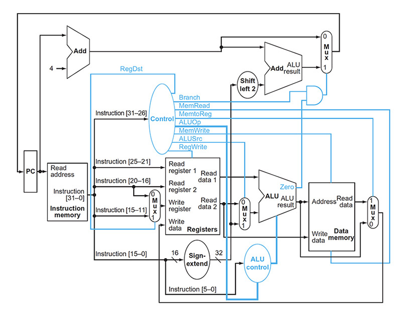

# Mips assembly 32 model baseted Python

Tested on
win11 - Python 3.10

# Description:
This package made for study and research of Mips Assembly 32 bits processor.
the package include python model of the processor, live diagrams and rich reference.

Fully recommended to use with Jupyter notebook or similar.